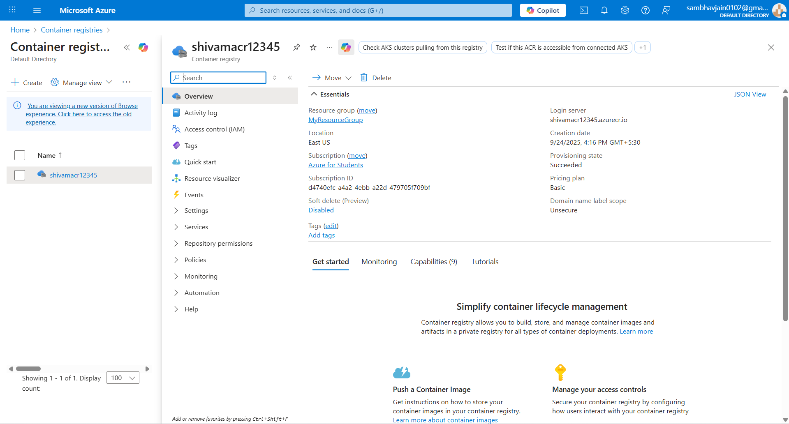

# 🚀 CI/CD with Node.js, Docker & Azure Pipelines

This project documents the **complete journey** of building and deploying a Node.js application using **Azure DevOps Pipelines**, **Docker**, and a **self-hosted agent**.  
It covers **task, approach, setup, errors, fixes, and outcomes**.

---

## 🎯 Task
- Build a **Node.js app**
- Containerize with **Docker**
- Push image to **Azure Container Registry (ACR)**
- Automate via **Azure DevOps Pipeline** running on a **self-hosted agent**

---

## 🛠 Approach
1. Set up a **self-hosted agent** on Windows.  
2. Configure **YAML pipeline** with Node.js build steps.  
3. Add **Docker build & push** stage.  
4. Troubleshoot blockers (agent setup, service connections, Docker).  
5. Validate successful image push to ACR.  

---

## 🏁 Setup from Zero

# Download and extract agent
cd C:\agent

# Configure agent
config.cmd

# Run interactively
run.cmd


* Created **Azure DevOps Project**
* Registered agent into **Default pool**
* Wrote initial `azure-pipelines.yml`

---

## 💻 Commands Used

| Purpose              | Command         |
| -------------------- | --------------- |
| Configure Agent      | `config.cmd`    |
| Run Agent            | `run.cmd`       |
| Install Node.js      | `NodeTool@0`    |
| Install dependencies | `npm install`   |
| Build app            | `npm run build` |
| Docker Build + Push  | `Docker@2`      |

---

## ⚠️ Errors & Fixes

| Error                                                      | Why it Happened                  | Fix                                                |
| ---------------------------------------------------------- | -------------------------------- | -------------------------------------------------- |
| `.\svc.cmd not recognized`                                 | Incomplete agent package         | Downloaded full agent with service files           |
| `svc.sh: command not found`                                | Tried Linux script in WSL        | Used correct Windows files (`svc.cmd`)             |
| `No agent pools to display`                                | Agent not registered properly    | Added to **Default pool**                          |
| `Could not find pool Azure Pipelines`                      | Wrong pool name in YAML          | Changed to `Default`                               |
| `azureSubscription expects AzureRM but got dockerregistry` | Wrong service connection type    | Created both AzureRM + Docker Registry connections |
| `docker daemon not running`                                | Docker Desktop not started/admin | Started Docker Desktop with admin rights           |

---

## 📊 Expected vs Actual Output

| Step            | Expected      | Actual                                  |
| --------------- | ------------- | --------------------------------------- |
| Agent setup     | Agent online  | ✅ Online after fixes                    |
| Node.js install | v20 available | ✅ Installed                             |
| Build           | Success       | ✅ Worked                                |
| Docker build    | Image created | ❌ Failed initially → ✅ after Docker fix |
| Docker push     | Image in ACR  | ✅ Verified                              |

---

## 🔄 Workflow


## 📜 Final Pipeline YAML

```yaml
trigger:
- main

# Use a Microsoft-hosted agent
pool:
  name : Default

variables:
  imageName: webcloudnexus
  acrLoginServer: cloudnexusacr.azurecr.io
  tag: latest

steps:
# Step 1: Install Node.js
- task: NodeTool@0
  inputs:
    versionSpec: '20.x'
  displayName: 'Install Node.js'

# Step 2: Install dependencies & build
- script: |
    npm install
    npm run build
  displayName: 'npm install and build'

# Step 3: Build and push Docker image to ACR
- task: Docker@2
  inputs:
    containerRegistry: 'cn'   # ← exact service connection name
    repository: $(acrLoginServer)/$(imageName)
    command: buildAndPush
    Dockerfile: '**/Dockerfile'
    tags: $(tag)

```

---

## 📸 Visuals

Below are some key visuals from the project workflow:

* **Pipeline Success**  
  

* **ACR Repository**  
  

---


## ✅ Final Outcome

* Pipeline runs on **code push to master**
* Builds Node.js app
* Creates Docker image
* Pushes image to **Azure Container Registry**
* Image is ready for deployment

---

## 👨‍💻 Author

**Shivam Malviya**
*DevOps Enthusiast | Cloud & Automation | Open to Collaboration* 🚀

